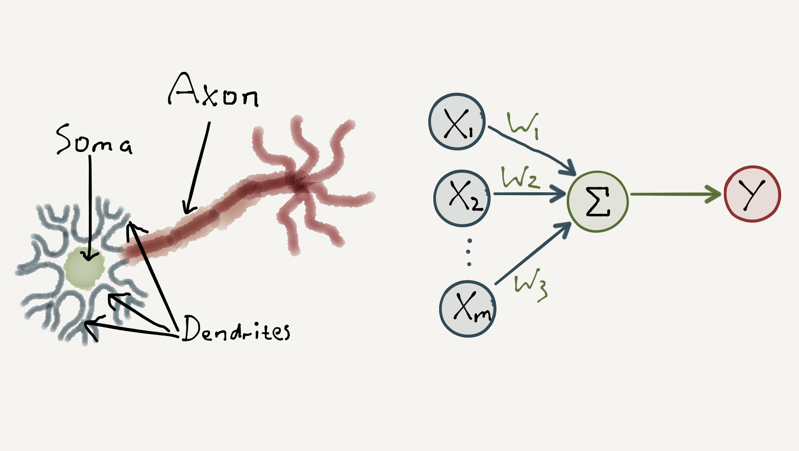
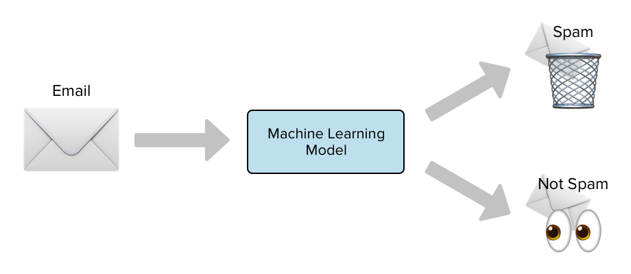

# Workshop d'Intelligence Artificielle - Exercises

Ce projet propose plusieurs exercices pour explorer différents aspects de l'intelligence artificielle: la base, la détection de spam dans les e-mails et la prédiction de la météo à l'aide d'un réseau de neurones. Il vous apprendra à découvrir et maîtriser les différents outils communément utilisé dans le secteur de l'IA.

## Préparation de l'environnement

Avant de commencer les exercices, assurez-vous de suivre les instructions dans le fichier [`SETUP.md`](SETUP.md) pour configurer votre environnement de développement Python avec les bibliothèques nécessaires.

**L'environnement venv** permet de ne pas installer ses librairies à son root mais plutôt dans un dossier/environnement qui sera propre au projet. Si une utilisation de librairie vient à déteriorer quelque chose ce sera seulement votre environnement que vous pourrez supprimer et re-créer librement. C'est ce que l'on appelle un package manager qui est semblable à `npm`.

**Jupyter Notebook (.ipynb)** est une plateforme de développement interactive qui offre la possibilité d'éxecuter le code brique par brique. Ainsi les éléments pouvant prendre plus de temps ne sont pas nécéssairement re-éxécuter pour tester une seule partie du code ! C'est compatible Python et Markdown. Tous les exercises seront à réaliser à l'aide des notebooks où seulement certaines parties du code seront à compléter.

**Les .csv** c'est l'extension des datasets (=ensemble de données pour réaliser des entraînements) les données sont séparés avec une virgule comme son nom l'indique; **Comma-separated values**. Mais peut aussi avoir n'importe quel symbole comme séparateur. Ces données sont compactes mais simple d'utilisations avec les nombreuses librairies comme Pandas.

## Exercise 1: Perceptron

Pour commencer vous allez devoir réaliser un perceptron. C'est la base d'un réseau de neurones. Un perceptron est un modèle mathématique inspiré du fonctionnement du cerveau humain. Il prend des données en entrée (comme la couleur et la forme des fruits) et les traite pour prendre une décision (comme dire s'il s'agit d'une pomme ou d'une banane).

Voici comment cela fonctionne : le perceptron attribue des poids à chaque donnée d'entrée, comme si certaines caractéristiques des fruits étaient plus importantes que d'autres pour décider s'il s'agit d'une pomme ou d'une banane. Ensuite, il combine ces poids avec les données d'entrée et les passe à travers une fonction d'activation.

La fonction d'activation agit comme un seuil: si la combinaison des poids et des données dépasse ce seuil, le perceptron dit que c'est une pomme, sinon il dit que c'est une banane. C'est un peu comme si le robot examinait les caractéristiques des fruits et décidait en fonction de ses expériences passées.

Le perceptron apprend en comparant sa prédiction avec la bonne réponse et en ajustant ses poids en conséquence. Plus il voit de fruits, mieux il devient à les reconnaître.

## Exercise 2: Détection de Spam dans les E-mails

Dans cet exercice, vous allez construire un système de détection de spam dans les e-mails en utilisant des techniques d'apprentissage automatique. Vous travaillerez avec un ensemble de données d'e-mails étiquetés comme spam ou non-spam (ham). Cet exercise vous aidera à prendre en main les outils comunéments utilisé dans le secteur de l'intelligence artificielle.

**Scénario :** Vous êtes un ingénieur en informatique chargé de développer un système de filtrage de spam pour une entreprise de messagerie. Votre tâche consiste à créer un modèle capable de détecter efficacement les e-mails indésirables et de les bloquer avant qu'ils n'atteignent la boîte de réception des utilisateurs.

## Exercise BONUS: Prédiction de la Météo avec un Réseau de Neurones (from scratch)

Dans cet exercice, vous allez implémenter un réseau de neurones à partir de zéro pour prédire la météo en fonction de certaines variables d'entrée. Ce projet vous aidera à comprendre les principes fondamentaux des réseaux de neurones et leur application à des problèmes du monde réel.

**Scénario :** Vous êtes un scientifique des données travaillant pour une entreprise météorologique. Votre objectif est de développer un modèle de prédiction météorologique précis qui peut être utilisé pour informer le public des conditions météorologiques à venir. Vous allez construire un réseau de neurones capable de prendre en compte des variables telles que la température, la pression atmosphérique, l'humidité, etc., pour prédire le temps qu'il fera dans une région donnée à une heure donnée.

Pour ces exercises je pense qu'il est bon de vous mettre au point sur certains aspects des réseaux de neurones:

### 1. De quoi est composé un réseau de neurones ?

Un NN (Neural Network) est généralement composé de 3 différentes "parties" de neurones:
- Input Layer: C'est la couche où nos données sont envoyées en tout premier à notre réseau de neurones. Notre input peut être fractionnées en petits morceaux pour être facilement traité par notre réseau qui pourra y reconnaître des patterns.
- Hidden Layer: Les couches cachées sont intermédiaires entre l'entrée et la sortie, où le traitement des données a lieu. Chaque couche cachée contient un certain nombre de neurones qui prennent les valeurs des couches précédentes, effectuent des calculs sur ces valeurs, et transmettent ensuite le résultat à la couche suivante.
- Output Layer: C'est la dernière couche d'un réseau de neurones, où les résultats sont produits. Chaque nœud dans cette couche représente une classe ou une prédiction possible. Les valeurs calculées dans cette couche sont souvent soumises à une fonction d'activation spécifique pour obtenir les sorties finales du réseau.

### 2. C'est quoi une fonction d'activation ?

Imagine que tu as un réseau de neurones, comme une série de boîtes reliées les unes aux autres. Chaque boîte (ou neurone) reçoit une information en entrée et la traite pour produire une sortie. Maintenant, une fonction d'activation est comme un filtre que tu places à la sortie de chaque boîte. Elle décide si le neurone devrait être "allumé" ou "éteint" en fonction de l'information qu'elle reçoit.

En d'autres termes, une fonction d'activation ajoute de la non-linéarité au réseau de neurones, ce qui lui permet d'apprendre des relations plus complexes entre les données en introduisant des comportements non linéaires entre les couches de neurones.

**ReLU (Rectified Linear Unit) :**   
ReLU est l'une des fonctions d'activation les plus simples et les plus utilisées. Elle fonctionne comme suit : si l'entrée est positive, elle laisse passer cette valeur sans modification (elle est "activée"), mais si elle est négative, elle la transforme en zéro (elle est "désactivée").

Imagine que tu aies un interrupteur dans ta chambre. S'il fait jour, tu laisses la lumière entrer, sinon tu l'éteins. C'est un peu comme ReLU. S'il y a de la lumière (une valeur positive), tu laisses passer. Sinon, tu ne la laisses pas passer du tout (tu mets zéro).

ReLU est populaire car elle est simple à calculer et peut accélérer l'apprentissage des réseaux de neurones profonds. Elle aide également à résoudre le problème de la disparition du gradient, ce qui signifie qu'elle permet aux réseaux de neurones de mieux apprendre et de converger plus rapidement vers de bonnes solutions.

En résumé, une fonction d'activation comme ReLU agit comme un interrupteur dans un réseau de neurones, déterminant si un neurone doit être activé ou non en fonction de son entrée, et ReLU en particulier est une fonction qui laisse passer les valeurs positives et met zéro pour les valeurs négatives.

Je vous conseil d'aller voir rapidement [ce site](https://deeplylearning.fr/cours-theoriques-deep-learning/fonction-dactivation/) pour avoir un aperçu des différentes fonctions d'activations, leur comportement et cas d'utilisation.

---
En suivant les instructions fournies dans ce README.md et en utilisant les ressources disponibles dans les dossiers, vous serez en mesure de compléter avec succès les exercices. Amusez-vous bien et n'hésitez pas à me poser des questions si vous en avez !
